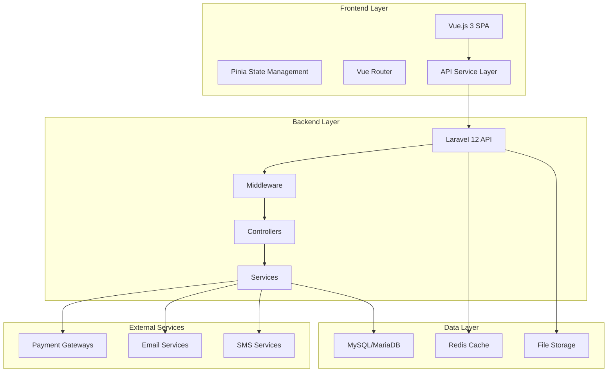
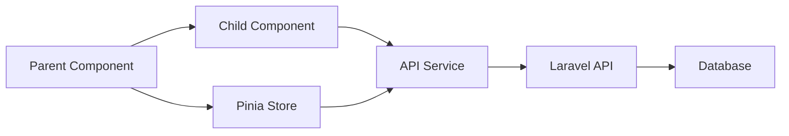
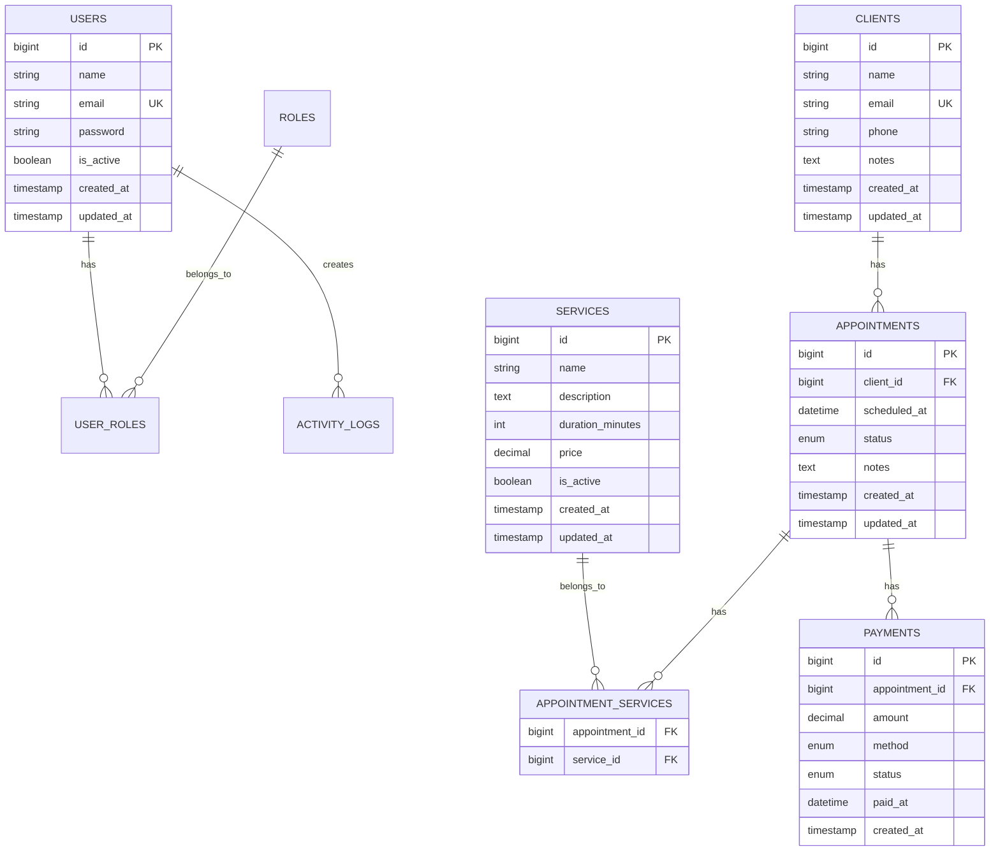
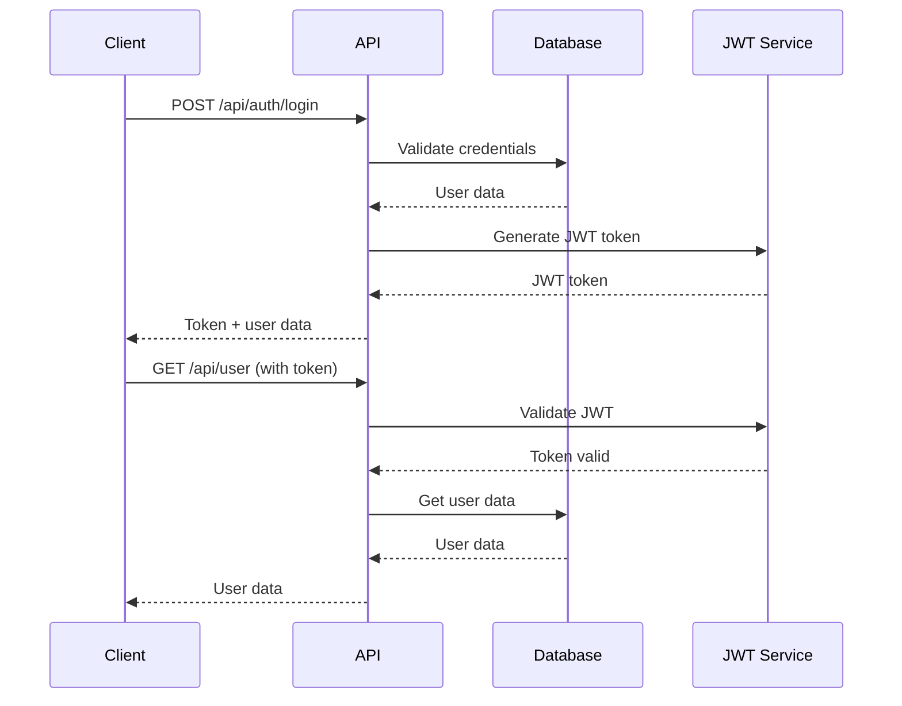
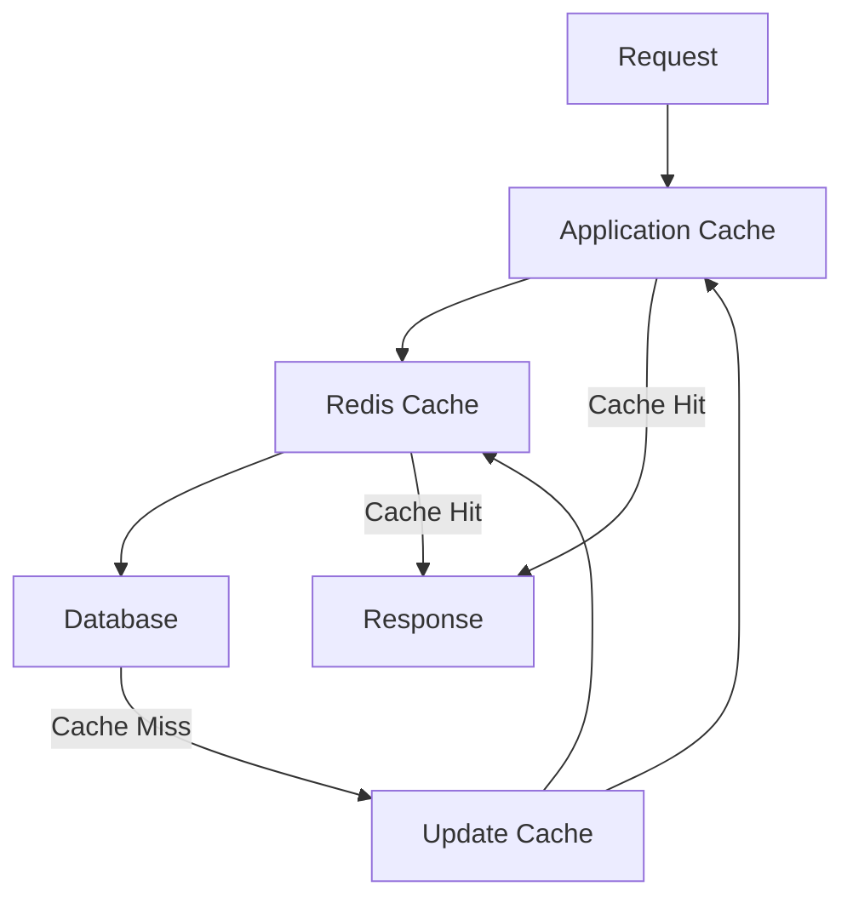
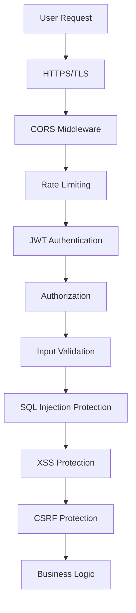
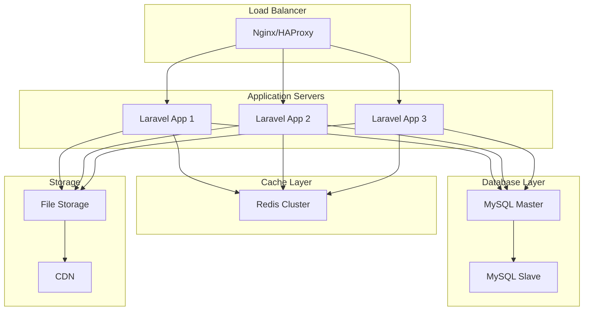

# SmartBiz Architecture Overview

## 🏗️ System Architecture

### High-Level Architecture



## 🎯 Frontend Architecture

### Technology Stack
- **Framework**: Vue.js 3 with Composition API
- **State Management**: Pinia
- **Routing**: Vue Router 4
- **UI Framework**: Tailwind CSS
- **Build Tool**: Vite
- **HTTP Client**: Fetch API with custom service layer
- **Type Checking**: JavaScript (JSDoc annotations)

### Component Architecture

```
src/
├── components/           # Reusable components
│   ├── BaseComponent.vue    # Base loading/error component
│   ├── DataTable.vue        # Advanced table component
│   ├── Navigation.vue       # Main navigation
│   └── Modal.vue           # Modal component
├── views/                # Page components
│   ├── Dashboard.vue       # Main dashboard
│   ├── clients/           # Client management
│   │   ├── Clients.vue
│   │   ├── ClientForm.vue
│   │   └── ClientDetails.vue
│   ├── appointments/      # Appointment management
│   │   ├── Appointments.vue
│   │   ├── Calendar.vue
│   │   └── AppointmentForm.vue
│   ├── services/          # Service management
│   │   ├── Services.vue
│   │   └── ServiceForm.vue
│   ├── payments/          # Payment management
│   │   └── Payments.vue
│   └── auth/              # Authentication
│       └── Login.vue
├── services/             # API service layer
│   ├── api.js            # Main API service
│   └── auth.js           # Authentication service
├── stores/               # State management
│   ├── auth.js           # Authentication state
│   └── app.js            # Application state
├── router/               # Routing configuration
│   └── index.js
└── utils/                # Utility functions
    ├── helpers.js
    └── constants.js
```

### State Management Pattern

```javascript
// Pinia Store Example
export const useAuthStore = defineStore('auth', () => {
  const user = ref(null)
  const token = ref(localStorage.getItem('token'))
  const loading = ref(false)
  
  const login = async (credentials) => {
    loading.value = true
    try {
      const response = await ApiService.login(credentials)
      user.value = response.user
      token.value = response.token
      localStorage.setItem('token', response.token)
    } finally {
      loading.value = false
    }
  }
  
  const logout = () => {
    user.value = null
    token.value = null
    localStorage.removeItem('token')
  }
  
  return { user, token, loading, login, logout }
})
```

### Component Communication



## 🔧 Backend Architecture

### Technology Stack
- **Framework**: Laravel 12
- **Database**: MySQL 8.0+ / MariaDB 10.3+
- **Cache**: Redis
- **Queue**: Database Queue
- **Authentication**: JWT
- **Validation**: Laravel Form Requests

### Directory Structure

```
app/
├── Http/
│   ├── Controllers/
│   │   ├── Api/              # API Controllers
│   │   │   ├── BaseController.php
│   │   │   ├── ClientController.php
│   │   │   ├── AppointmentController.php
│   │   │   ├── ServiceController.php
│   │   │   ├── PaymentController.php
│   │   │   └── DashboardController.php
│   │   └── AuthController.php
│   ├── Middleware/          # Custom middleware
│   │   ├── JwtMiddleware.php
│   │   └── CorsMiddleware.php
│   └── Requests/           # Form request validation
│       ├── ClientRequest.php
│       ├── AppointmentRequest.php
│       └── PaymentRequest.php
├── Models/                 # Eloquent models
│   ├── User.php
│   ├── Client.php
│   ├── Appointment.php
│   ├── Service.php
│   ├── Payment.php
│   └── ActivityLog.php
├── Services/              # Business logic services
│   ├── AppointmentService.php
│   ├── PaymentService.php
│   └── NotificationService.php
├── Providers/              # Service providers
│   └── AppServiceProvider.php
└── Jobs/                   # Queue jobs
    ├── SendAppointmentReminder.php
    └── GenerateDailyReport.php
```

### Controller Architecture

```php
// Base Controller Pattern
abstract class BaseApiController extends Controller
{
    protected function logActivity(string $action, string $entity, int $entityId): void
    {
        ActivityLog::create([
            'user_id' => Auth::id(),
            'action' => $action,
            'entity' => $entity,
            'entity_id' => $entityId,
        ]);
    }

    protected function successResponse(string $message, $data = null, int $status = 200): JsonResponse
    {
        $response = ['message' => $message];
        if ($data !== null) {
            $response['data'] = $data;
        }
        return response()->json($response, $status);
    }
}
```

### Service Layer Pattern

```php
class AppointmentService
{
    public function createAppointment(array $data): Appointment
    {
        return DB::transaction(function () use ($data) {
            $appointment = Appointment::create($data);
            $appointment->services()->attach($data['service_ids']);
            
            // Send notifications
            $this->sendConfirmationNotification($appointment);
            
            return $appointment;
        });
    }
    
    private function sendConfirmationNotification(Appointment $appointment): void
    {
        // Notification logic
    }
}
```

## 🗄️ Database Architecture

### Database Schema



### Database Optimization

```php
// Model Relationships with Optimization
class Appointment extends Model
{
    protected $with = ['client', 'services'];
    
    public function client(): BelongsTo
    {
        return $this->belongsTo(Client::class);
    }
    
    public function services(): BelongsToMany
    {
        return $this->belongsToMany(Service::class, 'appointment_services');
    }
    
    public function payments(): HasMany
    {
        return $this->hasMany(Payment::class);
    }
}

// Query Optimization
$appointments = Appointment::with([
    'client:id,name,email',
    'services:id,name,price'
])->orderBy('scheduled_at', 'desc')->get();
```

## 🔌 API Architecture

### RESTful API Design

```
/api/v1/
├── auth/
│   ├── POST    /login
│   ├── POST    /logout
│   └── GET     /user
├── clients/
│   ├── GET     /clients
│   ├── POST    /clients
│   ├── GET     /clients/{id}
│   ├── PUT     /clients/{id}
│   └── DELETE  /clients/{id}
├── appointments/
│   ├── GET     /appointments
│   ├── POST    /appointments
│   ├── GET     /appointments/{id}
│   ├── PUT     /appointments/{id}
│   ├── DELETE  /appointments/{id}
│   ├── POST    /appointments/{id}/services/{serviceId}
│   └── DELETE  /appointments/{id}/services/{serviceId}
├── services/
│   ├── GET     /services
│   ├── POST    /services
│   ├── GET     /services/{id}
│   ├── PUT     /services/{id}
│   └── DELETE  /services/{id}
├── payments/
│   ├── GET     /payments
│   ├── POST    /payments
│   ├── GET     /payments/{id}
│   ├── PUT     /payments/{id}
│   └── DELETE  /payments/{id}
└── dashboard/
    ├── GET     /dashboard/summary
    ├── GET     /dashboard/monthly-revenue
    └── GET     /dashboard/upcoming-appointments
```

### API Response Format

```json
// Success Response
{
  "message": "Resource created successfully",
  "data": {
    "id": 1,
    "name": "John Doe",
    "email": "john@example.com"
  }
}

// Error Response
{
  "message": "Validation failed",
  "errors": {
    "name": ["The name field is required."],
    "email": ["The email must be a valid email address."]
  }
}
```

### Authentication Flow



## 🔄 Caching Strategy

### Multi-Level Caching



### Cache Implementation

```php
// Cache Configuration
'cache' => [
    'default' => env('CACHE_DRIVER', 'redis'),
    'stores' => [
        'redis' => [
            'driver' => 'redis',
            'connection' => 'cache',
        ],
        'database' => [
            'driver' => 'database',
            'table' => 'cache',
            'connection' => null,
        ],
    ],
],

// Cache Usage in Controllers
public function index(): JsonResponse
{
    $clients = Cache::remember('clients.all', 3600, function () {
        return Client::withCount('appointments')->orderBy('name')->get();
    });
    
    return response()->json(['clients' => $clients]);
}
```

## 🔒 Security Architecture

### Security Layers



### Security Implementation

```php
// JWT Middleware
class JwtMiddleware
{
    public function handle($request, Closure $next)
    {
        $token = $request->bearerToken();
        
        if (!$token) {
            return response()->json(['message' => 'Token required'], 401);
        }
        
        try {
            $payload = JWT::decode($token, env('JWT_SECRET'), ['HS256']);
            $request->auth = $payload;
        } catch (Exception $e) {
            return response()->json(['message' => 'Invalid token'], 401);
        }
        
        return $next($request);
    }
}

// Input Validation
class ClientRequest extends FormRequest
{
    public function rules(): array
    {
        return [
            'name' => 'required|string|max:255',
            'email' => 'required|email|unique:clients,email',
            'phone' => 'nullable|string|max:20',
            'notes' => 'nullable|string|max:1000',
        ];
    }
}
```

## 📊 Monitoring & Logging

### Logging Strategy

```php
// Logging Configuration
'channels' => [
    'stack' => [
        'driver' => 'stack',
        'channels' => ['single', 'slack'],
    ],
    'single' => [
        'driver' => 'single',
        'path' => storage_path('logs/laravel.log'),
        'level' => env('LOG_LEVEL', 'debug'),
    ],
    'activity' => [
        'driver' => 'daily',
        'path' => storage_path('logs/activity.log'),
        'level' => 'info',
        'days' => 30,
    ],
],

// Activity Logging
class ActivityLog extends Model
{
    protected $fillable = ['user_id', 'action', 'entity', 'entity_id'];
    
    public static function log(string $action, string $entity, int $entityId): void
    {
        static::create([
            'user_id' => Auth::id(),
            'action' => $action,
            'entity' => $entity,
            'entity_id' => $entityId,
        ]);
    }
}
```

## 🚀 Performance Optimization

### Frontend Optimization

```javascript
// Lazy Loading Components
const Dashboard = defineAsyncComponent(() => import('./views/Dashboard.vue'))

// Route-based Code Splitting
const routes = [
  {
    path: '/dashboard',
    component: () => import('./views/Dashboard.vue')
  }
]

// API Service Optimization
class ApiService {
  private cache = new Map()
  
  async request(endpoint, options = {}) {
    const cacheKey = `${endpoint}:${JSON.stringify(options)}`
    
    if (this.cache.has(cacheKey)) {
      return this.cache.get(cacheKey)
    }
    
    const data = await this.fetchData(endpoint, options)
    this.cache.set(cacheKey, data)
    return data
  }
}
```

### Backend Optimization

```php
// Query Optimization
class AppointmentController extends BaseApiController
{
    public function index(): JsonResponse
    {
        $appointments = Appointment::with([
            'client:id,name,email',
            'services:id,name,price'
        ])
        ->orderBy('scheduled_at', 'desc')
        ->paginate(20);
        
        return response()->json($appointments);
    }
}

// Database Indexing
Schema::create('appointments', function (Blueprint $table) {
    $table->index(['client_id', 'scheduled_at']);
    $table->index(['status', 'scheduled_at']);
    $table->index('created_at');
});
```

## 🔧 Deployment Architecture

### Production Deployment



### Environment Configuration

```bash
# Production Environment Variables
APP_ENV=production
APP_DEBUG=false
APP_URL=https://smartbiz.example.com

# Database Configuration
DB_CONNECTION=mysql
DB_HOST=db-cluster.example.com
DB_DATABASE=smartbiz_prod
DB_USERNAME=smartbiz_user
DB_PASSWORD=secure_password

# Cache Configuration
CACHE_DRIVER=redis
SESSION_DRIVER=redis
QUEUE_CONNECTION=redis

# Performance
OPCACHE_ENABLE=1
OPCACHE_JIT_BUFFER_SIZE=100M

# Security
ENCRYPTION_KEY=your-encryption-key
JWT_SECRET=your-jwt-secret
```

---

**SmartBiz architecture is designed for scalability, performance, and maintainability, following modern web development best practices and industry standards.**
