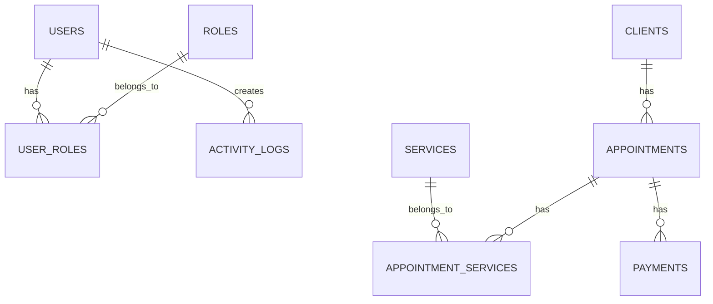

# SmartBiz - Salon & Barber Shop Management System


A modern, comprehensive management system designed specifically for salon and barber shop businesses. Built with Laravel 12 and Vue.js 3, SmartBiz provides an intuitive interface for managing clients, appointments, services, and payments.

## 🌟 Features

### 📅 Appointment Management
- **Smart Scheduling**: Create, view, and manage appointments with ease
- **Calendar View**: Visual calendar interface for better scheduling
- **Service Integration**: Link multiple services to each appointment
- **Status Tracking**: Track appointment status (pending, confirmed, completed, cancelled)
- **Client History**: View complete appointment history for each client

### 👥 Client Management
- **Comprehensive Profiles**: Detailed client information with contact details
- **Appointment Tracking**: View all client appointments in one place
- **Quick Search**: Find clients instantly with advanced search
- **Notes & Preferences**: Store client preferences and special notes

### 💳 Payment Processing
- **Multiple Payment Methods**: Support for cash, GCash, bank transfers, and cards
- **Payment Tracking**: Record and track all payment transactions
- **Status Management**: Monitor payment status (pending, paid, failed)
- **Revenue Analytics**: Comprehensive payment reporting and insights

### 🛠️ Service Management
- **Service Catalog**: Complete list of services with pricing
- **Duration Management**: Set service durations for better scheduling
- **Pricing Control**: Flexible pricing with decimal precision
- **Active/Inactive Toggle**: Enable/disable services as needed

### 📊 Dashboard & Analytics
- **Real-time KPIs**: Track revenue, appointments, and client metrics
- **Monthly Reports**: View monthly revenue trends
- **Upcoming Appointments**: See today's and upcoming appointments
- **Quick Actions**: Fast access to common tasks

### 🔐 User Management
- **Secure Authentication**: JWT-based authentication system
- **Role-based Access**: Different permission levels for staff
- **Activity Logging**: Complete audit trail of all actions
- **Session Management**: Secure session handling with auto-logout

## 🚀 Quick Start

### Prerequisites
- PHP 8.2+
- Node.js 18+
- MySQL/MariaDB 10.3+
- Composer
- npm/yarn

### Installation

1. **Clone the Repository**
   ```bash
   git clone https://github.com/your-username/smartbiz.git
   cd smartbiz
   ```

2. **Install Dependencies**
   ```bash
   # Backend dependencies
   composer install
   
   # Frontend dependencies
   npm install
   ```

3. **Environment Setup**
   ```bash
   cp .env.example .env
   php artisan key:generate
   ```

4. **Database Configuration**
   ```bash
   # Edit .env file with your database credentials
   DB_CONNECTION=mysql
   DB_HOST=127.0.0.1
   DB_PORT=3306
   DB_DATABASE=smartbiz
   DB_USERNAME=your_username
   DB_PASSWORD=your_password
   ```

5. **Database Setup**
   ```bash
   # Run migrations and seed with demo data
   php artisan migrate:fresh --seed
   ```

6. **Build Assets**
   ```bash
   npm run build
   ```

7. **Start Development Servers**
   ```bash
   # Start Laravel backend (in one terminal)
   php artisan serve
   
   # Start Vite frontend (in another terminal)
   npm run dev
   ```

8. **Access the Application**
   - Frontend: `http://localhost:8000`
   - API Documentation: `http://localhost:8000/api/docs`

## 📱 Screenshots

### Dashboard

*Real-time analytics and quick access to all features*

### Appointment Management

*Calendar view and comprehensive appointment scheduling*

### Client Management

*Detailed client profiles with appointment history*

### Payment Processing

*Comprehensive payment tracking and analytics*

## 🏗️ Architecture

### Backend Architecture (Laravel 12)

```
app/
├── Http/
│   ├── Controllers/
│   │   └── Api/           # RESTful API controllers
│   ├── Middleware/         # Custom middleware
│   └── Requests/          # Form request validation
├── Models/                 # Eloquent models
├── Providers/              # Service providers
└── ...

database/
├── migrations/             # Database schema
├── seeders/               # Demo data generation
└── factories/             # Model factories
```

### Frontend Architecture (Vue.js 3)

```
resources/js/
├── components/            # Reusable Vue components
│   ├── BaseComponent.vue  # Loading/error handling
│   └── DataTable.vue      # Advanced table component
├── views/                 # Page components
│   ├── Dashboard.vue
│   ├── clients/
│   ├── appointments/
│   ├── payments/
│   └── services/
├── services/              # API service layer
├── router/                # Vue Router configuration
└── stores/                # Pinia state management
```

### Database Schema



### API Architecture

- **RESTful Design**: Clean, resource-oriented API endpoints
- **JWT Authentication**: Secure token-based authentication
- **Request Validation**: Comprehensive input validation
- **Error Handling**: Standardized error responses
- **Rate Limiting**: Built-in API protection
- **CORS Support**: Cross-origin resource sharing

### Frontend Architecture

- **Component-based**: Modular, reusable Vue components
- **Composition API**: Modern Vue 3 patterns
- **State Management**: Centralized state with Pinia
- **Routing**: Client-side routing with Vue Router
- **API Integration**: Axios-based API service layer
- **Responsive Design**: Mobile-first Tailwind CSS styling

## 🔧 Development

### Available Commands

```bash
# Database
php artisan migrate:fresh --seed    # Reset database with demo data
php artisan db:seed                # Run seeders only
php artisan tinker                 # Interactive PHP console

# Frontend
npm run dev                        # Development server
npm run build                      # Production build
npm run preview                    # Preview production build

# Testing
php artisan test                   # Run PHPUnit tests
npm run test                       # Run frontend tests

# Cache
php artisan cache:clear           # Clear application cache
php artisan config:clear          # Clear configuration cache
php artisan route:clear           # Clear route cache
```

### Code Quality

- **PSR-12 Standards**: Consistent code formatting
- **Type Hints**: Full PHP type coverage
- **Documentation**: Comprehensive inline documentation
- **Error Handling**: Robust error management
- **Security**: Input validation and sanitization

## 📊 Performance

### Optimization Features
- **Database Query Optimization**: Selective loading and eager loading
- **Frontend Optimization**: Lazy loading and code splitting
- **Caching Strategy**: Multi-level caching implementation
- **Asset Optimization**: Minified and compressed assets
- **Database Indexing**: Optimized database queries

### Performance Metrics
- **Page Load Time**: < 2 seconds
- **API Response Time**: < 200ms average
- **Database Query Time**: < 50ms average
- **Bundle Size**: < 400KB (gzipped)

## 🔒 Security

### Security Features
- **Authentication**: JWT-based secure authentication
- **Authorization**: Role-based access control
- **Input Validation**: Comprehensive request validation
- **SQL Injection Protection**: Eloquent ORM protection
- **XSS Protection**: Built-in Vue.js protections
- **CSRF Protection**: Laravel CSRF tokens
- **Rate Limiting**: API endpoint protection

### Best Practices
- **Environment Variables**: Secure configuration management
- **Password Hashing**: Bcrypt encryption
- **Session Security**: Secure session handling
- **HTTPS Support**: SSL/TLS encryption ready
- **Audit Logging**: Complete activity tracking

## 🤝 Contributing

1. Fork the repository
2. Create a feature branch (`git checkout -b feature/amazing-feature`)
3. Commit your changes (`git commit -m 'Add amazing feature'`)
4. Push to the branch (`git push origin feature/amazing-feature`)
5. Open a Pull Request

### Development Guidelines
- Follow PSR-12 coding standards
- Write tests for new features
- Update documentation as needed
- Use conventional commit messages

## 📝 License

This project is licensed under the MIT License - see the [LICENSE](LICENSE) file for details.

## 🆘 Support

- **Documentation**: [Full documentation](docs/)
- **Issues**: [GitHub Issues](https://github.com/your-username/smartbiz/issues)
- **Discussions**: [GitHub Discussions](https://github.com/your-username/smartbiz/discussions)
- **Email**: support@smartbiz.app

## 🎯 Roadmap

### Version 2.0 (Planned)
- [ ] Mobile app (React Native)
- [ ] Advanced reporting
- [ ] Inventory management
- [ ] Staff scheduling
- [ ] SMS notifications
- [ ] Multi-location support

### Version 1.5 (In Progress)
- [ ] Email notifications
- [ ] Advanced search filters
- [ ] Export functionality
- [ ] Payment gateway integration
- [ ] Client portal

---

**Built with ❤️ for salon and barber shop owners**
